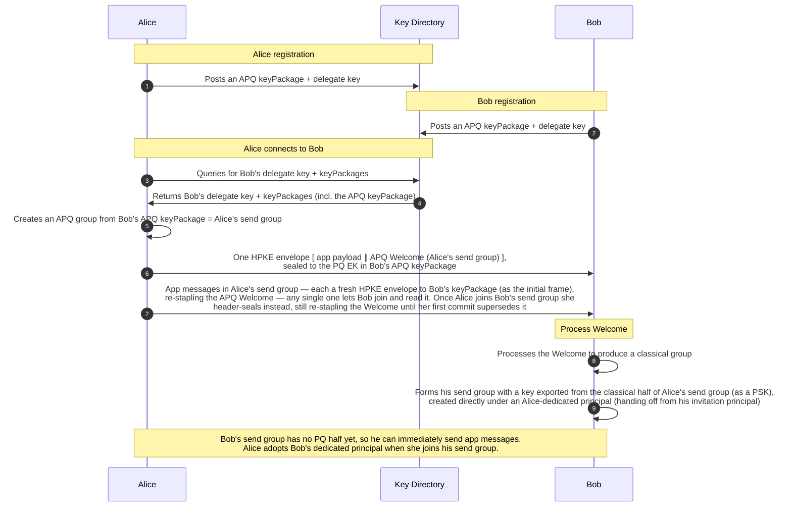
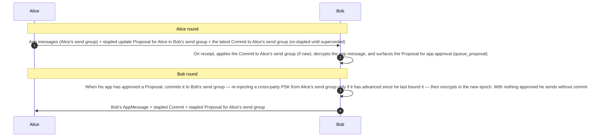
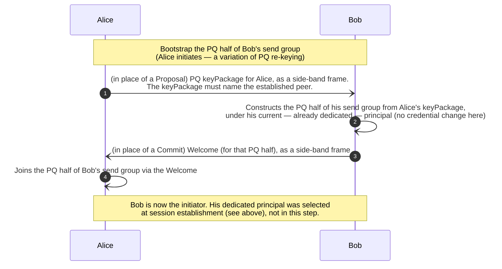
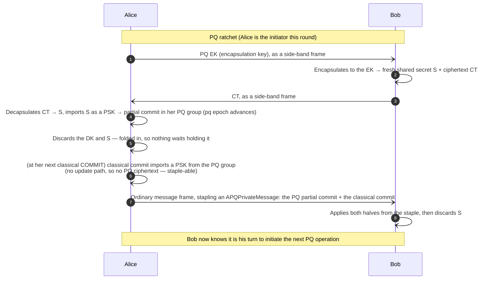
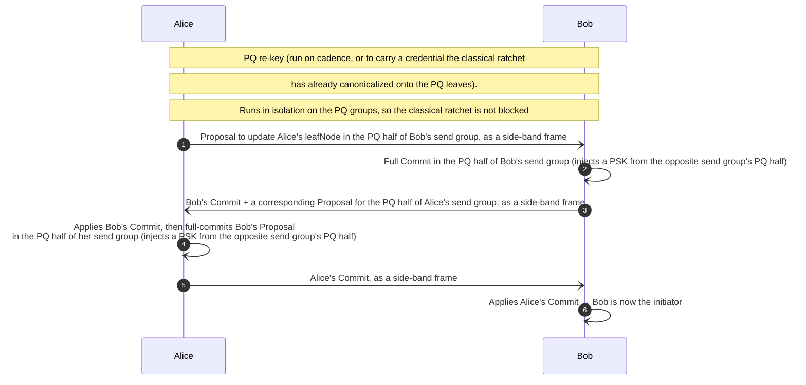
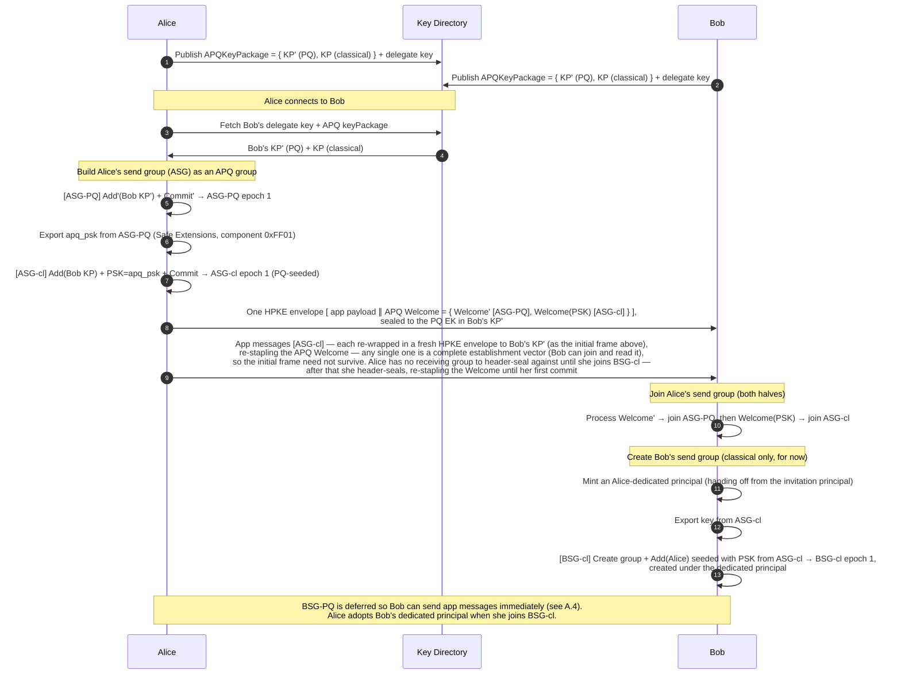
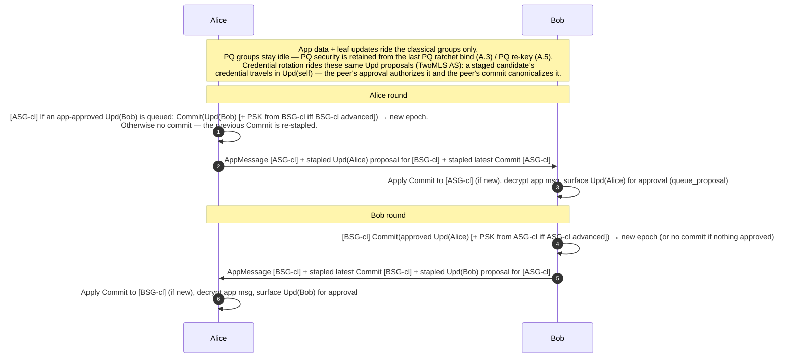
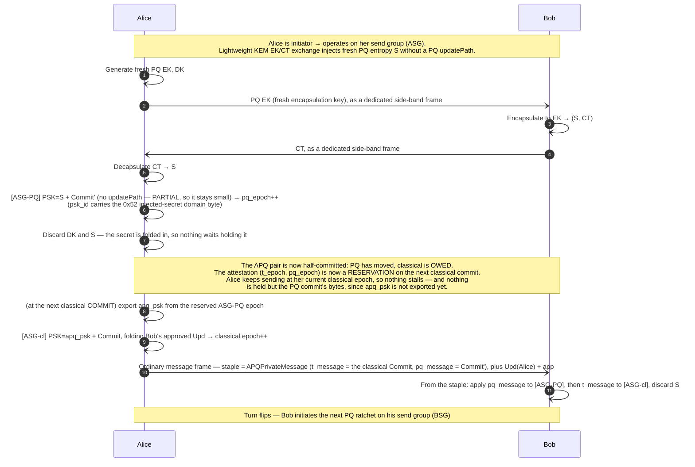
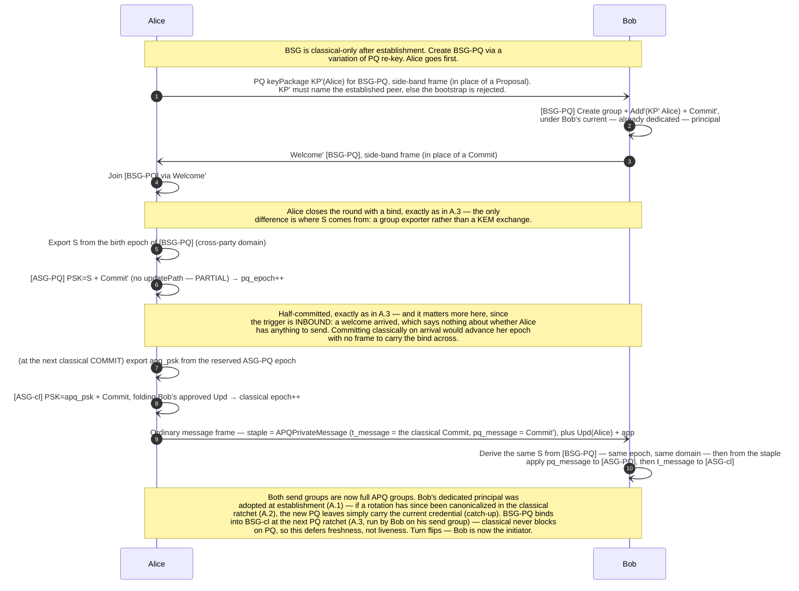
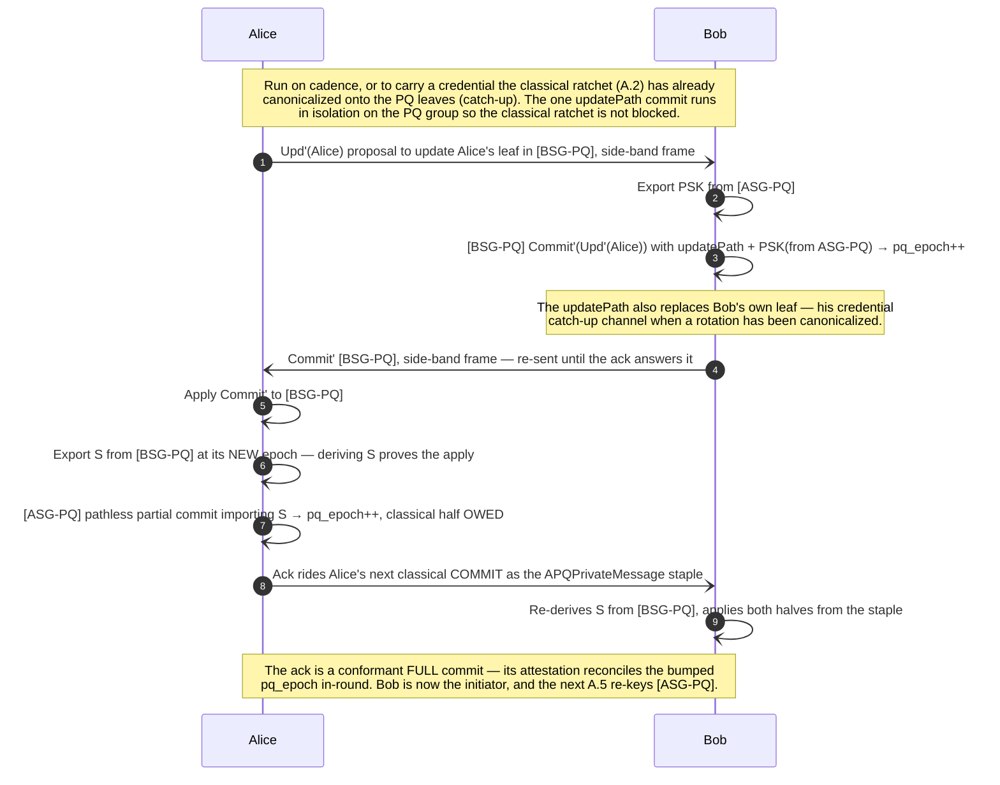

# Protocol Flows

The authoritative TwoMLSPQ / APQ protocol design: session establishment, the classical
ratchet, and the three PQ side-band operations, as message sequence diagrams. Appendix A
gives the granular MLS operations behind each.

This chapter used to live in the `architecture-diagrams` repo. It moved here for the reason
that repo's README already gives for everything else it retired — *"duplicating it here is
what let these docs drift"*. A protocol design that does not ride with its implementation
drifts from it: the code cannot be reviewed against a spec in another repo, and a spec cannot
fail a test. Here, a flow and the code that implements it change in one commit.

Where this chapter and the rest of the book overlap, the altitude differs rather than the
content: [Session Lifecycle](./session-lifecycle.md) is the API caller's view of the same
three side-band flows (which function to call, in what order), while this is the protocol
they implement (which secret moves where, and why the epochs must line up). The
[Wire Format](./wire-format.md) is what they travel in.


## Sketch

APQ gives us a means for 2 parties to establish and evolve shared PQ cryptographic state, and to choose intervals to bind that PQ state to classical MLS group(s) that is the primary mechanism for a messaging session.

Unfortunately the full APQ commit as defined in the draft makes the full PQ commit, with a new leafNode, and updatePath, and a PQ cipher text, a prerequisite to decrypting appMessages in the corresponding classical group. This makes it impossible to implement the kinds of amortizing strategies that are currently deployed, if decrypting new messages is now contingent on first receiving a large PQ commit.

For parity with the current state of the art in hybrid 1:1 ratcheting sessions, we use APQ groups as our state machine, but separate the roles of

1. efficiently attaining PQ PCS in the classical group 
2. updating our PQ group state

that the APQ full commit currently accomplishes.

In its place we have two PQ operations:

1. A PQ ratchet
    1. Takes the following steps:
        1. The initiator (Alice) sends a PQ EK, as a dedicated side-band frame
        2. The respondent (Bob) picks a fresh random secret (S) and *seals* it to the EK — under a key bound to the KEM shared secret **and** a repeatable export of Alice's PQ group at its current epoch — returning `[enc][sealed S]` as a dedicated side-band frame. (Sealing a random S rather than using the KEM output directly is what lets Alice *open* it: ML-KEM decapsulation returns garbage, not an error, for a ciphertext answering a different ephemeral, so only the AEAD tag over S can reject a stale or misdirected ciphertext before it is injected. S is then hybrid-secure — it holds if either ML-KEM or the epoch secret does.)
        3. Alice opens S (an explicit receipt; a stale ciphertext fails here with her ephemeral and PQ leaf intact), imports it as a PSK into her PQ group as a partial commit, and binds it to her classical group, advancing both halves' epochs
            1. The corresponding classical commit imports a PSK from the PQ group, as the draft’s FULL commit would
            2. Since the PQ commit doesn’t have an update path, it is only encrypted with the previous group secret and not any PQ ciphertexts, so we can staple it to outgoing messages alongside the classical commit
            3. Alice can then discard the corresponding DK and S.
        4. On receipt of the stapled PQ and classical commits (one APQPrivateMessage staple advancing both groups' epochs), Bob can apply it and then discard S
    2. An attacker cannot compute the new PQ or classical group state without having had access to either the DK, or the shared secret S, in the window between when they were generated and discarded
    3. On receipt of the stapled PQ partial commit, Bob knows that it is his turn to initiate a PQ operation.
2. Re-key the PQ group
    
    We still need to regularly re-key the PQ group, on cadence, and to hand the PQ leaves to a credential the classical ratchet has already canonicalized (credential changes are proposed and approved in the classical ratchet — see the TwoMLS AS note below; the PQ re-key only catches the PQ leaves up):
    
    1. The initiator (Alice) sends a proposal to update her leafNode in the PQ half of the respondent’s (Bob’s) send group — the proposal replaces the *proposer’s* leaf
    2. On receipt, Bob makes a full commit in his send group — the one large updatePath commit of the round, which also replaces the *committer’s* leaf (this is where Bob’s own leaf catches up to a rotated credential)
        1. Like in TwoMLS, this full commit injects a PSK from the opposite send group.
    3. On receipt of Bob’s PQ commit, Alice applies it and acks: a pathless partial commit on her own send group importing a secret exported from the just-rekeyed group, bound to her classical group exactly as the PQ ratchet’s bind is — it rides her next classical commit as the staple. Deriving the secret requires having applied Bob’s commit, so an ack that applies at all is the receipt.
    4. On receipt of the stapled ack, Bob is now the initiator
    
    One round re-keys ONE group; the turn alternation brings the other group’s round next. The large updatePath commit happens in isolation on the PQ group, otherwise we block the classical ratchet on transmitting it — only the small pathless ack rides the classical staple.

1. Session establishment
    1. Bob posts an APQ keyPackage
    2. Alice forms an APQ group (as her send group), sends the APQ Welcome
    3. Bob derives his send group from the classical half of Alice’s send group, with a PSK, inheriting the PQ initiation
        1. Bob’s send group starts with only its classical half — he doesn’t yet create the PQ half — so that he can immediately send app messages from his send group, with stapled classical keys.

Now we have two independent state machines.

1. Classical Ratchet
    1. The classical ratchet proceeds exactly as in TwoMLS, exchanging rounds of AppMessage + Proposal + Commit, all stapled together
    2. A sender commits to its send group only when it is **licensed** to (see Evidence-gating below), and only when it has something to commit: a peer proposal its app has approved (`queue_proposal`), or an owed PQ bind to discharge. Until then each frame re-staples the latest commit, and app messages keep flowing in the current epoch
    3. Such a commit also re-injects a cross-party PSK exported from the sender's receive group (the TwoMLS binding), but only when that group has **advanced** since the sender last bound it — i.e. when the peer has produced new entropy to entangle with (a peer commit or a PQ ratchet). Re-binding an unadvanced peer epoch would add nothing, so a commit with no new peer entropy carries no cross-party PSK (it still refreshes the sender's own leaf via the updatePath, and folds the peer's Update if it carries one). This is what keeps the two send groups entangled with each other's *current* state, rather than re-stating a binding already in force.
    4. Credential rotation rides this same ratchet (the TwoMLS AS): staged candidate credentials travel in the stapled Update proposals, the peer's approval of a proposal is the authorization, and the peer's commit canonicalizes the winner — the PQ leaves only catch up later (A.4/A.5)

### Evidence-gating: at most one commit outstanding, per direction

A sender may only commit **once the peer has demonstrably applied its previous commit**. Each
send group is a single-writer channel — only its owner ever commits in it — so this is a
per-direction rule, and it is the invariant two other properties silently rest on:

- **Any single frame heals the peer.** Every frame re-staples the sender's latest commit, which
  bridges a peer that is *at most one* commit behind. A sender that could commit twice while the
  peer was away would produce a staple nothing bridges — an unrecoverable `EpochDesync` in
  ordinary lossy messaging, rather than the re-establish-only edge it is.
- **A bind's staple provably survives until applied.** A bind's PQ half exists on the wire only
  as the current staple (§A.3–A.5); a superseded staple never re-sends, and by then `owed_bind`
  is consumed and the PQ exporter leaf is spent. If a sender could commit past an unapplied bind,
  the peer's recv-PQ mirror would permanently lose an epoch the sender's send-PQ has advanced
  past — and no classical reconnect repairs a PQ group.

**The evidence is the peer's stapled proposal, and it is in-protocol.** The peer builds its
`Upd(self)` in *its recv group*, which **is** our send group, so the proposal is bound to our
send group's epoch: an offer bound to our current epoch could only have been produced by a party
that had applied our commits through it. Our own commit invalidates any offer still in flight
(it was built for the prior epoch), and the peer re-proposes at the new epoch on its next frame —
so the license is re-earned exactly once per round trip. (The peer's *commit* proves the same
fact, but any frame carrying their commit also carries their proposal at our epoch — the frame is
`[staple][proposal][app]`, all sections mandatory — so proposal-evidence strictly contains
commit-evidence, and it also arrives on the frames where they don't commit.)

**The license is not approval, but it is authenticated.** It accrues at receive, independent of
`queue_proposal`: an offer the app never approves, is slow to approve, or whose credential the AS
would refuse still licenses the discharge — approval is the app's to withhold (it is the AS
authorization step, and folding stays gated on it), but the license is not the app's to stall, so
a bug or delay in approving a remote proposal can never block a bind's classical commit. What the
license does require is that the offer *validate* against our send group (the same
`validate_offered_update` a fold runs, applied here unconditionally): the epoch field of raw
proposal bytes is unsigned, so trusting it would let a malicious peer splice a higher epoch and
forge the license into discharging a bind the peer has not applied. A valid offer proves exactly
our current send epoch, and the watermark is stamped to that.

This was implicit for as long as folding an approved proposal was the *only* way to commit: the
fold IS the evidence, since `validate_offered_update` runs the offer through mls-rs against the
live send group and a stale-epoch offer is refused there. Committing without a fold (to discharge
an owed bind) needs the same license, so the watermark is now tracked explicitly rather than
inferred from the fold.

**Where each ratchet advances.** TwoMLS is a state machine advanced by sending and processing
messages: the PQ ratchet advances when a PQ step is processed, but the classical ratchet advances
only at `prepare_to_encrypt` — the host's own next send. So the library never commits classically
behind the app: a PQ trigger leaves an *owed* bind, and the discharge (fold or licensed
proposal-less commit) rides whatever round the host starts. There is deliberately no third reason
to commit — no commit on cadence merely because the license is present — since every commit of
ours invalidates the peer's in-flight offer, and committing every licensed round would churn
offers inside the window the peer's app has to approve them. A host that wants leaf-refresh PCS
faster than its PQ cadence should run the PQ ratchet faster; the bind carries both PCS sources.

> **Why the proposal and not the PSK.** The peer's commit that cross-injects a PSK exported from
> our send group at epoch *E* is also proof it applied *E* — it cannot export from a mirror it has
> not advanced. It is not used as the license because it rides **commits only**, and both
> directions would then gate on each other: two sides that commit concurrently (neither having
> seen the other's) each hold an unapplied commit and neither can produce the evidence that would
> release the other. The proposal rides **every frame**, commit or not, so the license cannot
> deadlock. (The injection remains a useful *check*, and the header-key application receipt —
> deleted with the retirement machinery — was the weaker version of the same idea: it proved
> transport-window position where the proposal proves MLS state incorporation.)

Independently, we have an exchange of large PQ key messages, carried as dedicated side-band frames alongside the classical ratchet. The state flip-flops when each direction has finished receiving a message from the other.

1. PQ operations
    1. At the end of session establishment, Alice and Bob now exchange (large) PQ messages independently of the classical ratchet
    2. Alice and Bob take turns initiating PQ operations. Alice is first, and makes a variation of PQ re-keying to bootstrap Bob’s group:
        1. (In place of a proposal) Alice sends a PQ keyPackage to Bob
        2. (In place of a commit) Bob constructs the PQ half of his send group from it and replies with a Welcome (for that group)
        3. The operation ends when Alice joins via the Welcome, and Bob is now the initiator
    
    (Bob’s dedicated principal is selected at session establishment, not here. Alice started with a principal she generated to talk to Bob’s invitation principal; Bob accepts under a principal dedicated to Alice — his send group is created directly under it, and Alice adopts it when she joins his group. The PQ bootstrap and re-key only carry already-canonical credentials onto the PQ leaves.)

## Session establishment



At this point Alice's send group is a full APQ group. Bob's send group has only its classical half, but this session establishment is protected with the PQ key Bob posted, and the PQ leaf node key Alice sent within her APQ welcome. Because we exported keys from the PQ half of Alice's send group to its classical half, and then to Bob's classical half, Bob's send group is protected by the PQ key exchange. Bob can then immediately send messages to Alice.

At this point we assume a slow, failable bidirectional channel for Alice and Bob to exchange large payloads, carried as dedicated PQ side-band frames alongside the app messages on the send groups' classical halves. Every steady-state frame — message-path and side-band alike — leaves the library header-encrypted (sealed under a key exported from the receiving group), so frame metadata is not visible on the wire. In the pre-establishment window, until a party has a receiving group to export from, its app messages ride HPKE envelopes sealed to the peer's keyPackage (as the initial frame), not header-encrypted frames.

## Classical Ratchet



## Finish PQ Setup



## PQ Ratchet



## Re-key the PQ Group



---

## Appendix A — Granular MLS Operations

The diagrams above treat each **send group** as one black box. In reality, Alice
and Bob each operate a **send group** (the group they alone commit to) and a
**receive group** (the other party's send group, into which they only propose).
A 1:1 TwoMLSPQ group therefore comprises two **send groups**:

- **ASG** — Alice's send group (Alice commits, Bob is a member)
- **BSG** — Bob's send group (Bob commits, Alice is a member)

Each **send group** is implemented as an **APQ group**
([draft-ietf-mls-combiner-02](https://www.ietf.org/archive/id/draft-ietf-mls-combiner-02.html)) —
not a single MLS group but two parallel
[RFC 9420](https://www.rfc-editor.org/rfc/rfc9420) MLS groups with
synchronized membership —

- a **PQ MLS group** (PQ-KEM / PQ-DSA ciphersuite), and
- a **classical MLS group** (traditional ciphersuite).

The two halves are bound by exporting a secret from the PQ group and importing
it into the classical group as a **PreSharedKey** proposal.

> **Implemented binding (conforms to draft -02).** The `apq_psk` follows the
> draft's Safe Extensions recipe (`draft-ietf-mls-extensions-08` §4.4) and is
> imported as an `application(3)` PSK:
>
> ```
> apq_exporter = SafeExportSecret(component_id = 0xFF01)   # consumed leaf of the PQ epoch's exporter tree
> apq_psk_id   = DeriveSecret(apq_exporter, "psk_id")
> apq_psk      = DeriveSecret(apq_exporter, "psk")
> ```
>
> The draft's bookkeeping rides with it: an `APQInfo` GroupContext extension
> (type `0xF0A1`) in both halves, and an `AppDataUpdate` proposal (type
> `0x0008`) in both commits of every FULL commit attesting the post-commit
> `(t_epoch, pq_epoch)` pair. [PSK Binding](./psk-binding.md) has the full
> recipe, [group rules](./group-rules.md) rule 7 the verification, and the
> [Wire Format](./wire-format.md) chapter the conformance cutover. Two
> deliberate deviations remain: `APQInfo` is written once at creation and
> never rewritten — epoch freshness lives in the per-commit `AppDataUpdate`,
> not a rewritten extension — and the A.3 injected secret `S` is Germ's own
> addition, an `external(1)` PSK with id `LE-u64(epoch) ‖ group_id ‖ 0x52`,
> kept disjoint from the exported application ids.

A full session is thus **four MLS groups**: `ASG-PQ`, `ASG-cl`, `BSG-PQ`, `BSG-cl`.

**Notation** (following the combiner draft):

- a trailing `'` marks an object in the **PQ** MLS group (`Commit'`, `Welcome'`, `Add'`, `Upd'`, `KP'`)
- an object without `'` is in the **classical** MLS group
- `PSK=apq_psk` is the PreSharedKey proposal (`psk_id=apq_psk_id`) carrying the secret exported from the paired PQ group
- bracket tags such as `[ASG-cl]` or `[BSG-PQ]` name the MLS group an operation runs in
- the crate's demo and tests share this orientation: the initiator is "Alice"
  and builds `Group_A` (≡ ASG), the acceptor is "Bob" and builds `Group_B`
  (≡ BSG)

**Commit vocabulary.** "Full/partial" is an MLS (RFC 9420) distinction, and this
doc uses it only in that sense: a **full** commit carries an updatePath (fresh
leaf — the PCS contribution); a **partial** commit is path-less. Draft -02
overloads the same words for a different axis — its FULL commit is the composite
PQ-commit + paired-classical-commit operation (mandatory for Add/Remove), its
PARTIAL commit a classical-only commit — but this design decomposes the draft's
FULL commit and does not use that pair. Our three operations, by name:

- **Classical-ratchet commit** (A.2) — classical-only. Folds the peer's
  approved Upd (so it carries an updatePath) and re-injects the cross-party
  TwoMLS PSK **when the peer's send group has advanced** since the last binding
  (otherwise it carries no PSK — see §Classical Ratchet). In -02's terms, a
  PARTIAL commit.
- **PQ ratchet bind** (A.3) — both halves advance: a path-less PSK-injection
  Commit' (cheap — no per-member PQ ciphertexts) plus the classical commit
  importing the re-exported `apq_psk`, carried together as the -02 `APQPrivateMessage`
  the message frame staples. Introduces PQ Post-Compromise Security.
- **PQ re-key** (A.5) — ONE updatePath Commit' in the PQ group alone (the
  expensive leaf rotation, run rarely, off the classical ratchet's critical
  path), answered by the initiator's ack — which is structurally the A.3 bind:
  a path-less partial Commit' plus its classical partner, stapled as one
  `APQPrivateMessage`. One round re-keys one group; the turn alternation
  covers the other.

What -02 calls a FULL commit is, here, the bind — which closes every round
(A.3, A.4 and A.5 alike); the re-key's standalone updatePath Commit' is our
extension to the draft.

### A.1 Session establishment (granular)



### A.2 Classical ratchet (granular) — classical-only commits



### A.3 PQ ratchet (granular) — PQ partial commit (no updatePath) + classical commit, stapled



**Why the PQ half cannot wait, and the classical half must.** `apq_psk` is exported from the PQ
group's POST-commit epoch, so the classical commit cannot even be built until the PQ one has
applied. That ordering is forced — and it is what lets `S` be folded in and wiped immediately
rather than held.

The classical half is the opposite. Applying it advances the epoch Alice's ordinary traffic
rides, onto a commit whose `apq_psk` the peer can only derive from this bind's PQ half. Applied
at the trigger, every frame Alice sends before the bind lands is undeliverable — and in A.4 the
trigger is inbound, so she may have nothing to send at all.

Note what is NOT held: `apq_psk` is exported at the commit that consumes it, not at the trigger.
The exporter leaf is spent on first use and cannot be re-derived, so exporting early would mean
carrying live key material — and archiving it — across a wait we do not bound. Deferring the
export leaves only public commit bytes waiting.

**The bind is not a frame. It is an `APQPrivateMessage` in the staple slot.**
draft-ietf-mls-combiner-02 §7 defines it, and defines no `APQCommit` — a FULL commit travels as a
message carrying both halves:

```
struct {
  MLSPrivateMessage t_message;
  MLSPrivateMessage pq_message;
} APQPrivateMessage
```

So the bind rides the ordinary message frame, as its staple. Three things follow, each a
mechanism we would otherwise have had to invent:

- **A lost bind heals itself.** The staple is re-sent on every frame until superseded, so the PQ
  commit re-staples for free. Nothing else could carry it: a message frame that overtook a
  separate bind would staple a classical commit the peer cannot apply, lacking the `apq_psk` that
  only the PQ half supplies.
- **The round keeps its `Upd` and its fold.** The bind IS the classical committing round, not an
  extra commit beside one, so it stages the routine proposal and folds the peer's approved one
  like any other commit.
- **It is affordable only because `Commit'` is PARTIAL.** Re-stapling is cheap because classical
  staples carry no PQ keys; a pathless PSK commit is a few hundred bytes. A.5's updatePath
  commits must never ride the staple — already their rule, and this is what gives it teeth.

**Why "the next classical commit" and not "the next send".** The attestation
`AppDataUpdate{t_epoch, pq_epoch}` rides both halves and is checked twice by the receiver: each
half pre-apply against that group's `context.epoch + 1`, and both post-apply against the groups'
actual epochs. Alice fixes those numbers before the PQ commit, so they hold only if nothing else
takes the epochs meanwhile. Hence two rules while a bind is owed:

1. **The next classical commit IS this bind.** A routine fold taking that epoch would leave
   `t_epoch` one behind, and Bob rejects the bind pre-apply — with Alice's PQ leaf already spent,
   which no retry can rebuild.
2. **No second PQ commit lands.** It would move `pq_epoch` out from under the same reservation.
   Starting the next round stays free: an EK, or an A.5 `Upd'`, commits nothing.

So PQ never holds up classical — non-committing rounds send ordinary frames throughout — while
classical may in principle hold up the PQ ratchet. In practice it does not: the peer proposes an
`Upd` on every frame, and folding one is exactly what makes a classical round commit.

### A.4 Finish PQ setup (granular) — bootstrap BSG-PQ (Alice initiates)



**Why the bind leg exists.** Without it A.4 is the only two-leg operation, and the turn has to
pass at Bob's *send* rather than at an apply — so Bob is expected to open the next A.3 round while
his own Welcome' is still unconfirmed, and the two operations contend. The bind makes A.4 a
well-formed round (initiator → responder → initiator, as A.3 and A.5 already are), so the usual
rule applies unchanged: **the initiator relinquishes at its terminal send, the responder takes the
turn on applying it.**

**The receipt is free.** S is derivable only from *inside* [BSG-PQ], so a bind that applies at all
is proof Alice joined — the confirmation is a side effect of entropy Alice had to chain anyway,
not a payload. An ack frame would prove the same thing and do no work. Both parties derive the
same S independently from the same (group, epoch, domain), so it is never transmitted.

**Ordering constraint.** The exporter leaf is consumed on first export, so A.4's bind spends the
cross-party leaf of [BSG-PQ]'s birth epoch — on **both** sides, each in its own copy: Alice
exports it from her recv mirror to build the bind, and Bob exports it from his send group to
apply it. A later A.5 re-key must not re-export that epoch from either. (Both watermarks are
load-bearing; omitting the responder's makes the next re-key fail on a consumed leaf.)

### A.5 PQ re-key (granular) — the one updatePath commit, isolated from classical

> **Note on -02 conformance.** Draft -02 defines no *standalone* PQ-group commit:
> every PQ commit is one half of a simultaneous **FULL commit** (PQ + paired
> classical) with synchronized epoch bookkeeping. Germ's PQ re-key deliberately
> runs its one large updatePath commit in the PQ group **alone** (so the
> classical ratchet is not blocked on large ML-KEM updatePaths), which is an
> extension beyond -02 — but the round *ends* conformantly: the initiator's ack
> is an ordinary bind (a -02 FULL commit pair riding the message-frame staple as
> an `APQPrivateMessage`), whose `AppDataUpdate` reconciles the bumped
> `pq_epoch` in-round. The cross-injected `PSK(from …-PQ)` below is the TwoMLS
> PQ-to-PQ export between send groups, distinct from `apq_psk`. Like the
> classical ratchet (§Classical Ratchet), this cross-injection is event-driven:
> a re-key binds the opposite PQ send group only when it has advanced since the
> last binding, so a re-key that follows another with no intervening PQ commit
> from the peer carries no cross-party PSK (the leaf rotation still happens via
> the updatePath).
>
> **The round is `X → Y → bind`, like A.3 and A.4.** The proposal replaces the
> *proposer's* leaf (this is where the initiator's credential handoff rides);
> the full commit replaces the *committer's* leaf (this is where the responder's
> own leaf catches up to an already-canonical credential); the pathless ack
> signals receipt through the classical channel. One round re-keys ONE group —
> the turn alternation brings the other group's round next, at the same bytes
> per group as the old two-in-one shape, and no large frame is ever terminal.


